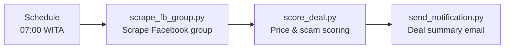

# Baubau Deal Finder

Monitors buy-and-sell Facebook groups in Baubau, Southeast Sulawesi.
Finds new items at second-hand prices, automatically, **100% free**, no paid API.


**Status:** In development. The pipeline, scoring, and HTTP API are tested locally; nothing is
deployed to the VPS yet (see the checklist below).

---

## Problem

Baubau's buy-and-sell Facebook groups are numerous and the data is scattered. You want to
find a good deal but don't feel like scrolling through the noise. Sometimes there's an
interesting new item at a second-hand price, but it gets missed because there are too many
listings.

## Solution

An automated pipeline that:
1. Scrapes the latest listings from Facebook groups
2. Scores each listing based on price, condition, and scam indicators
3. Sends a summary email of only the interesting deals



The n8n workflow (`n8n-workflow.json`) runs the same flow on a schedule, not just manually
from the CLI.

## Status

- [x] Scoring engine (`score_deal.py`), done, tested
- [x] Email notifier (`send_notification.py`), done
- [x] Pipeline orchestrator (`run_pipeline.py`), done, tested
- [x] Config (groups, categories, filters), done
- [x] Fixture data for testing, done
- [x] HTTP API wrapper (`tools/api.py`), done, tested locally (`/run` returns scored listings
      directly, no file reads needed)
- [x] Dockerfile + docker-compose.yml, done, matches the working `recipe_rag_api` pattern
- [x] n8n workflow JSON, rewritten to call the API over HTTP instead of `executeCommand`
      (the old version used local Windows paths that can't work inside n8n's Docker container)
- [ ] Push code and build the container on the VPS, not done yet
- [ ] Import the workflow into n8n.agungtrimahmudi.site, not done yet (do this *after* the
      container is running, not before)
- [ ] Set up `.env` next to `docker-compose.yml` on the VPS (SMTP credentials), not filled in yet
- [ ] Set up the Gmail OAuth2 credential in n8n, not done yet

## Quick Start (Dry Run)

No installation needed. Just the Python already on the machine:

```bash
cd "D:\Workflow Automation\Baubau Deal Finder"
python tools/run_pipeline.py --dry-run --no-notify
```

See the scoring results in `data/scored_listings.json`.

## Running It

```bash
# Full pipeline
python tools/run_pipeline.py

# Or stage by stage
python tools/scrape_fb_group.py
python tools/score_deal.py -i data/raw_listings.json -o data/scored_listings.json
python tools/send_notification.py -i data/scored_listings.json
```

## Manual Mode

If scraping isn't ready yet or you want to enter listings by hand:
```bash
python tools/scrape_fb_group.py --manual

# Then paste listings:
>> iPhone 14 BNIB|12500000|https://facebook.com/groups/xxx/posts/123
>> Samsung S23 Bekas|8000000|https://facebook.com/groups/xxx/posts/456
>> done
```

## n8n Integration

n8n runs in its own Docker container on the VPS, so it can't reach a local file path or run a
shell command on the host. The workflow calls a small HTTP API instead:

1. Push this folder to the VPS and build the container:
   ```bash
   docker compose up -d --build
   ```
   `docker-compose.yml` connects it to the same Docker network as n8n
   (`n8n-stack_default`), the same pattern `recipe_rag_api` already uses successfully.
2. Confirm it's reachable from inside the n8n container:
   ```bash
   curl -X POST http://baubau_deal_finder:8001/run?dry_run=true
   ```
3. Only then import `n8n-workflow.json` into n8n (importing before step 1 means the workflow
   fails every time it runs, since the container it calls doesn't exist yet).
4. Set up the Gmail OAuth2 credential in n8n.
5. Activate.

Workflow: Schedule (07:00 WITA) to HTTP Request (`/run`) to Format Email to Send Email. The API
returns the scored listings directly in the response, so nothing needs to read or write files
on the n8n side.

## Monitored Categories

- Phones / Smartphones
- Laptops / Notebooks
- Electronics (TV, AC, gaming consoles, etc.)
- Vehicles (motorcycles, cars)
- Fresh produce and food
- Furniture & household items

Edit `config/categories.json` to add or change categories.

## Structure

```
Baubau Deal Finder/
├── config/
│   ├── groups.json        # Target Facebook groups
│   ├── categories.json    # Categories + reference prices
│   └── filters.json       # Scoring thresholds + scam indicators
├── tools/
│   ├── run_pipeline.py    # Orchestrator
│   ├── scrape_fb_group.py # Scrape FB groups
│   ├── score_deal.py      # Deal scoring engine
│   ├── send_notification.py # Email notifications (SMTP, standalone CLI use)
│   ├── setup_env.py       # .env verification
│   └── api.py             # HTTP wrapper for n8n (POST /run)
├── workflows/
│   └── baubau-deal-finder.md
├── n8n-workflow.json      # Calls the API over HTTP, ready to import once deployed
├── Dockerfile             # Based on the Playwright image (browser already included)
├── docker-compose.yml     # Joins the same Docker network as n8n
├── requirements.txt
├── data/                  # Scraping + scoring results (gitignored)
├── .env.example           # Template only; real values go in the parent folder's .env
│                           # (local dev) or next to docker-compose.yml (VPS deploy)
├── .gitignore
├── LICENSE
└── README.md
```

## Cost

- **Scraping:** free (Playwright or requests + beautifulsoup)
- **Email:** free (Gmail SMTP)
- **Total:** $0/month

## License

MIT, see [LICENSE](LICENSE).

## 👤 Author

**Agung Tri Mahmudi**

- Email: agungtrimahmudi.it@gmail.com
- GitHub: [github.com/Agungtrimahmudi-automation](https://github.com/Agungtrimahmudi-automation)
- LinkedIn: [linkedin.com/in/agung-tri-mahmudi](https://linkedin.com/in/agung-tri-mahmudi)
