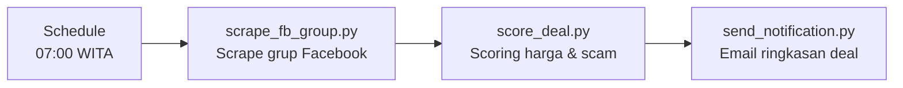

# Baubau Deal Finder

Pantau grup Facebook jual beli di Baubau, Sulawesi Tenggara.
Temukan barang baru d harga second — otomatis, **100% gratis**, tanpa API berbayar.


---

## Problem

Grup Facebook jual beli Baubau banyak dan data berhamburan. Mau cari deal
tapi males scroll karena noise. Kadang ada barang baru harga second yang
menarik, tapi terlewat karena terlalu banyak listing.

## Solution

Pipeline otomatis yang:
1. Scrape listing terbaru dari grup Facebook
2. Score setiap listing berdasarkan harga, kondisi, dan indikator scam
3. Kirim email ringkasan hanya deal yang menarik



Workflow n8n (`n8n-workflow.json`) menjalankan alur yang sama secara terjadwal, bukan cuma
manual dari CLI.

## Status

- [x] Scoring engine (`score_deal.py`) — selesai, tested
- [x] Email notifier (`send_notification.py`) — selesai
- [x] Pipeline orchestrator (`run_pipeline.py`) — selesai, tested
- [x] Config (groups, categories, filters) — selesai
- [x] n8n workflow JSON — selesai, siap import
- [x] Fixture data untuk testing — selesai
- [ ] Install di PC / deploy ke VPS — belum diputuskan
- [ ] Import workflow ke n8n.agungtrimahmudi.site — belum dilakukan
- [ ] Setup `.env` (SMTP credentials) — belum diisi

## Quick Start (Dry Run)

Tidak perlu install apa-apa. Cukup Python yang sudah ada:

```bash
cd "D:\Workflow Automation\Baubau Deal Finder"
python tools/run_pipeline.py --dry-run --no-notify
```

Lihat hasil scoring di `data/scored_listings.json`.

## Jalankan

```bash
# Full pipeline
python tools/run_pipeline.py

# Atau stage per stage
python tools/scrape_fb_group.py
python tools/score_deal.py -i data/raw_listings.json -o data/scored_listings.json
python tools/send_notification.py -i data/scored_listings.json
```

## Mode Manual

Kalau scraping belum ready atau mau input sendiri:
```bash
python tools/scrape_fb_group.py --manual

# Lalu paste listing:
>> iPhone 14 BNIB|12500000|https://facebook.com/groups/xxx/posts/123
>> Samsung S23 Bekas|8000000|https://facebook.com/groups/xxx/posts/456
>> selesai
```

## n8n Integration

File `n8n-workflow.json` siap di-import ke n8n:
1. Buka n8n dashboard
2. Import workflow → pilih file ini
3. Setup Gmail OAuth2 credential
4. Aktifkan

Workflow: Schedule (07:00 WITA) → Scoring → Email

## Kategori yang Dipantau

- HP / Smartphone
- Laptop / Notebook
- Elektronik (TV, AC, gaming console, dll)
- Kendaraan (motor, mobil)
- Buah & Makanan Segar
- Furniture & Rumah Tangga

Edit `config/categories.json` untuk tambah/ubah kategori.

## Struktur

```
Baubau Deal Finder/
├── config/
│   ├── groups.json        # Grup Facebook target
│   ├── categories.json    # Kategori + harga referensi
│   └── filters.json       # Threshold scoring + scam indicators
├── tools/
│   ├── run_pipeline.py    # Orchestrator
│   ├── scrape_fb_group.py # Scrape FB groups
│   ├── score_deal.py      # Deal scoring engine
│   ├── send_notification.py # Email notifikasi
│   └── setup_env.py       # Verifikasi .env
├── workflows/
│   └── baubau-deal-finder.md
├── n8n-workflow.json      # Siap import ke n8n
├── data/                  # Hasil scraping + scoring (gitignored)
├── .env                   # Credentials (gitignored)
├── .env.example
├── .gitignore
├── LICENSE
└── README.md
```

## Cost

- **Scraping:** gratis (Playwright atau requests+beautifulsoup)
- **Email:** gratis (Gmail SMTP)
- **Total:** $0/bulan

## Lisensi

MIT — lihat [LICENSE](LICENSE).

## 👤 Author

**Agung Tri Mahmudi**

- Email: agungtrimahmudi.it@gmail.com
- GitHub: [github.com/Agungtrimahmudi-automation](https://github.com/Agungtrimahmudi-automation)
- LinkedIn: [linkedin.com/in/agung-tri-mahmudi](https://linkedin.com/in/agung-tri-mahmudi)
